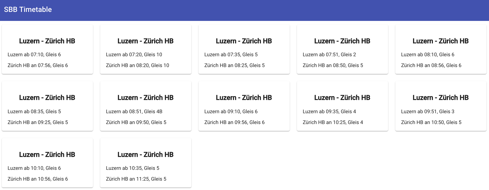
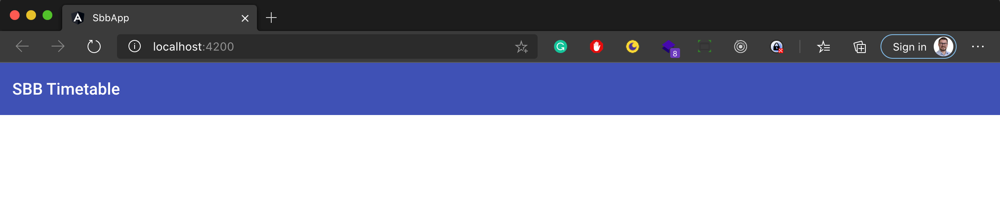

# Exercise: sbb-app

Let's create an SBB timetable app to get your hands dirty with Angular. For the sake of time, this exercise is more than less a copy/paste work. But you're more than welcome to think about each step and ask questions at the end of the exercise. We presume that you already have set up your work station with Git, Node.js, globally installed npm packages, and Visual Studio Code.

The final app looks like this:



## Step 1: Create a brand new Angular app

`ng new sbb-app --prefix=sbb --routing=false --style=css --strict=false --skipTests=true`

The above command will genereate an empty Angular application without routing and tests. For styling we chose CSS (Alternatives are scss, sass or less). The option `--prefix=sbb` is used for the naming of our components. Each component will be prefixed with _sbb_ (Default is _app_).
A bunch of files will be generated, and in the end a `npm install` command will be performed. Once this command has been completed, change into the newly created directory, named `sbb-app`.

## Step 2: Add ng-essentials

`ng add @froko/ng-essentials`

This will install better defaults for a new Angular application. The strategy behind the above command is called _schematics_, and allows the creation of new files, the manipulation of existing files and the installation of additional npm packages. Check out [https://www.npmjs.com/package/@froko/ng-essentials](https://www.npmjs.com/package/@froko/ng-essentials). When you open Visual Studio Code you will be prompted to install some additional extensions. It's highly recommended to accept these recommendations. They will give you a better experience during development.

<div style="page-break-after: always;"></div>

## Step 3: Add Angular Material Design

`ng add @angular/material`

Chose the default/minimal options. The above command is based on _schematics_ as well. This will add support for Angular's Material Design, which is not part of the standard installation.

## Step 4.0: Add a new header component

`ng generate component header` or short: `ng g c header`

This will create 3 files in the `src/app` directory:

- `header/header.component.css`: The styling of the component
- `header/header.component.html`: The markup of the component
- `header/header.component.ts`: The _code behind_ or _execution logic_ of the component

## Step 4.1: Add markup to the header component:

Replace the content of `header.component.html` with the following:

```html
<mat-toolbar color="primary">
  <span>SBB Timetable</span>
</mat-toolbar>
```

`mat-toolbar` is a web component from the Angular Material library. You may see red underscores since `mat-toolbar` is an unknown HTML element. We will fix this in the next step.

## Step 4.2: Add `MatToolbarModule` to `AppModule`

Add or replace the following lines in `app.module.ts`:

```typescript
import { MatToolbarModule } from "@angular/material/toolbar";
```

```typescript
@NgModule({
  declarations: [AppComponent, HeaderComponent],
  imports: [BrowserModule, MatToolbarModule],
  providers: [ENV_PROVIDERS],
  bootstrap: [AppComponent],
})
export class AppModule {}
```

<div style="page-break-after: always;"></div>

Since Angular is a framework by design, we have to register every building blocks like components, services, pipes, directives, and modules so that Angular knows about them. `AppModule` is the main module of our application. The `@NgModule` decorator makes the `AppModule` class an Angular module itself and has various arrays to register the different building blocks. Note, that the Angular CLI will automatically add newly generated components to the `declarations` array.

As you can imagine, the module decorator grows as the application grows, while the class itself stays empty in most cases.

The `MatToolbarModule` delivers the `mat-toolbar` web component. You may need to reload Visual Studio Code to make the red underscores go away in the `header.component.html` file.

## Step 4.3: Add the new header component to the app component markup

Delete the content of `app.component.html` and insert the snippet below:

```html
<sbb-header></sbb-header>
```

`sbb-header` is the name of the header component and is defined in the selector meta-data of `header.component.ts`. To prevent linting errors, we remove the constructor and the implementation of `OnInit`:

```typescript
@Component({
  selector: "sbb-header",
  templateUrl: "./header.component.html",
  styleUrls: ["./header.component.css"],
})
export class HeaderComponent {}
```

As you can see, our `HeaderComponent` does nothing, since it has no logic within the class itself. But the `@Component` decorator defines that this is a web component and it states where the Angular framework can find the markup and styling information.

<div style="page-break-after: always;"></div>

## Verification Step

`ng serve -o`

This will start our new Angular application in a watch-mode, which means that the application will be recompiled every time we make changes in the source code. The `-o` flag means, that your default browser will automatically open the application at `http://localhost:4200`. You should see something like this:



## Step 5.0: Add a new SBB module

`ng generate module sbb` or short: `ng g m sbb`

Although our application will not grow that big, we want to bring in some structure right from the beginning. Our newly created `SbbModule` is a feature module and should be designed as self-containing as possible. This means that we put in all components, services and other building blocks that belong to this feature topic. This way we can prevent the `AppModule` from growing too big.

## Step 5.1: Add `SbbModule` to `app.module.ts`

Add or replace the following lines in `app.module.ts`:

```typescript
import { SbbModule } from "./sbb/sbb.module";
```

```typescript
@NgModule({
  declarations: [AppComponent, HeaderComponent],
  imports: [BrowserModule, MatToolbarModule, SbbModule],
  providers: [ENV_PROVIDERS],
  bootstrap: [AppComponent],
})
export class AppModule {}
```

In contrast to a newly generated component, the Angular CLI will not update the `AppModule` automatically, since there are other possibilities to reference modules (e.g. LazyLoading). So we have to do this step by our-selves.

<div style="page-break-after: always;"></div>

## Step 6: Add a new timetable component to the `SbbModule`

`ng generate component sbb/timetable` or short: `ng g c sbb/timetable`

This will generate the timetable component and register it autmatically in the `SbbModule`. We will use this as a _container component_ or _smart component_, which holds multiple connections represented by cards/connections. The implementation will follow in further steps.

## Step 7: Add a new connection component to the `SbbModule`

`ng generate component sbb/connection` or short: `ng g c sbb/connection`

This will generate the connection component and register it autmatically in the `SbbModule`. We will use this as a _presentational component_ or _dumb component_. The implementation will follow in further steps.

## Step 8: Add a new service for data fetching and transformation

`ng generate service sbb/sbb` or short: `ng g s sbb/sbb`

This will generate a new service. A registration in the `SbbModule` is not necessary. Within this service we will encapsulate the `HTTP GET` call to the external SBB API and transform the received JSON data into a suitable form. It is always a good strategy to implement as much logic as possible in services. This will keep your components simple and enables potential reuse of functionality implemented in services. The implementation for our service will follow in a further step.

<div style="page-break-after: always;"></div>

## Step 9: Add a new model class for the `SbbModule`

Create a new file called `sbb.model.ts` in the folder `src/app/sbb` and paste the following lines into it:

```typescript
export interface Station {
  id: string;
  name: string;
}

export interface From {
  station: Station;
  departure: Date;
  platform: string;
}

export interface To {
  station: Station;
  arrival: Date;
  platform: string;
}

export interface Connection {
  from: From;
  to: To;
  duration: string;
}

export class FlatConnection {
  constructor(
    public from: string,
    public fromPlatform: string,
    public departure: Date,
    public to: string,
    public toPlatform: string,
    public arrival: Date,
    public duration: string
  ) {}

  static from(connection: Connection): FlatConnection {
    return new FlatConnection(
      connection.from.station.name,
      connection.from.platform,
      connection.from.departure,
      connection.to.station.name,
      connection.to.platform,
      connection.to.arrival,
      connection.duration
    );
  }
}
```

The interfaces above represent a statically typed and reduced version of the JSON response we will get, when we call the external api to get connections from station _A_ to station _B_.
The class `FlatConnection` represents a flattened model of the connections, which we will use as input for the connection components.

## Step 10: Make the base url of the external API configurable

Replace the `baseUrl` value in `src/environments/environment.ts` & `src/environments/environment.prod.ts`:

```typescript
const providers: any[] = [
  { provide: "environment", useValue: "Development" },
  { provide: "baseUrl", useValue: "http://transport.opendata.ch" },
];
```

This way we could potentionally use different APIs in different environments, like DEV, STAGE, or PROD. We will use the `baseUrl` value when we implement the `SbbService`.

## Step 11.0: Implement the timetable logic

In the following steps we will implement our timetable feature file by file. The order of the files may look counter-intuitive at a first glance, but the reason is quite simple: First, it's easier to give context informations and second, you won't have any not-yet-implemented errors.

## Step 11.1: Add additional dependencies tho the `SbbModule`

Add or replace the following lines in `sbb.module.ts`:

```typescript
import { HttpClientModule } from "@angular/common/http";
import { MatCardModule } from "@angular/material/card";
```

```typescript
@NgModule({
  declarations: [TimetableComponent, ConnectionComponent],
  imports: [CommonModule, HttpClientModule, MatCardModule],
  exports: [TimetableComponent],
})
export class SbbModule {}
```

We add Angular's HTTP client and Angular Material's CardModule to the registrations of `SbbModule` so that we can use them, when implementing the timetable logic.

<div style="page-break-after: always;"></div>

## Step 11.2: Implement the `SbbService`

Replace the content of `sbb.service.ts` with the following. Make sure that the url composition stays on a single line after pasting the snippet:

```typescript
import { HttpClient } from "@angular/common/http";
import { Inject, Injectable } from "@angular/core";

import { Observable } from "rxjs";
import { map } from "rxjs/operators";

import { Connection, FlatConnection } from "./sbb.model";

@Injectable({
  providedIn: "root",
})
export class SbbService {
  constructor(
    @Inject("baseUrl") private baseUrl: string,
    private http: HttpClient
  ) {}

  getConnections(from: string, to: string): Observable<FlatConnection[]> {
    const url = `${this.baseUrl}/v1/connections?from=${from}&to=${to}&limit=12`;

    return this.http.get<any>(url).pipe(
      map((result) => result.connections as Connection[]),
      map((connections) =>
        connections.map((connection) => FlatConnection.from(connection))
      )
    );
  }
}
```

There's much going on here... First of all, we annotate the `SbbService` class with the `@Injectable` decorator, so that Angular knows about it. The `providedIn: 'root'` statement makes the explicit registration in a module obsolete. The `SbbService` takes the `baseUrl` and the `HttpClient` as dependency by constructor injection.

The `getConnections` function takes the starting and final station as string parameters and returns an observable array of flattened connections. We can use the string interpolation feature to build the target URL out of the `baseUrl` and the `from` and `to` parameters. The external API's documentation can be found at http://transport.opendata.ch/docs.html.

The `get` function of the `HttpClient` returns an observable instance of the parsed JSON response. Since we don't have an interface or class which represents the whole response, we can savely use the built-in `any` type here. The untyped response is then mapped in two steps to the required format, namely an array of flattened connections.

_Hint/Question_: We see 3 usings of the map function, but not all of them have the same origin. Can you guess what the difference is?

## Step 11.3: Implement logic for the `TimetableComponent`

Replace the content of `timetable.component.ts` with the following:

```typescript
import { Component, OnInit } from "@angular/core";

import { Observable } from "rxjs";

import { FlatConnection } from "../sbb.model";
import { SbbService } from "../sbb.service";

@Component({
  selector: "sbb-timetable",
  templateUrl: "./timetable.component.html",
  styleUrls: ["./timetable.component.css"],
})
export class TimetableComponent implements OnInit {
  connections$: Observable<FlatConnection[]>;

  constructor(private service: SbbService) {}

  ngOnInit() {
    this.connections$ = this.service.getConnections("luzern", "zürich");
  }

  onSelect(connection: FlatConnection) {
    console.log(connection);
  }
}
```

Angular makes heavy use of Observables from the reactive extensions library called `RxJS`. Your teacher will give you more information about this topic, if needed. HTTP calls to a JSON Web API always return Observables of a given payload and so does our service call, which encapsulates the HTTP call. As a naming convention, all variables of type `Observable<T>` have a dollar sign (`$`) as suffix.

The service is brought to the component by dependency injection. The component itself implements Angular's OnInit lifecycle hook. The method `ngOnInit()` is called automatically by the framework when the component becomes alive.

<div style="page-break-after: always;"></div>

## Step 11.4: Add styling rules for the `TimetableComponent`

Add the following lines to the file `timetable.component.css`;

```css
.container {
  width: 100%;
  display: flex;
  flex-wrap: wrap;
}
```

This will cause our connection card elements to be dynamically aligned depending on the size of the browser window.

## Step 11.5: Implement logic for the `ConnectionComponent`

Replace the content of `connection.component.ts` with the following:

```typescript
import { Component, EventEmitter, Input, Output } from "@angular/core";

import { FlatConnection } from "../sbb.model";

@Component({
  selector: "sbb-connection",
  templateUrl: "./connection.component.html",
  styleUrls: ["./connection.component.css"],
})
export class ConnectionComponent {
  @Input() connection: FlatConnection;

  // eslint-disable-next-line @angular-eslint/no-output-native
  @Output() select = new EventEmitter<FlatConnection>();

  onClick() {
    this.select.emit(this.connection);
  }
}
```

As you can see, this component doesn't have any dependency but communicates solely by its `@Input` and `@Output` properties with the outside world. This is a primary characteristic of a _presentational-_ or _dumb component_. We don't needy a constructor or an `OnInit` lifecycle hook.

<div style="page-break-after: always;"></div>

## Step 11.6: Add styling rules for the `ConnectionComponent`

Add the following lines to the file `connection.component.css`;

```css
mat-card {
  width: 220px;
  margin: 10px;
  cursor: pointer;
}
```

Styles defined in component style sheet files are only valid for this particular component. If you need to define global styles, put them into the file `styles.css` instead.

## Step 11.7: Add markup to the connection component

Replace the content of `connection.component.html` with the following:

```html
<mat-card (click)="onClick()">
  <mat-card-header>
    <h3>{{ connection.from }} - {{ connection.to }}</h3>
  </mat-card-header>
  <mat-card-content>
    <p>
      {{ connection.from }} ab {{ connection.departure | date: 'HH:mm' }}, Gleis
      {{ connection.fromPlatform }}
    </p>
    <p>
      {{ connection.to }} an {{ connection.arrival | date: 'HH:mm' }}, Gleis {{
      connection.toPlatform }}
    </p>
  </mat-card-content>
</mat-card>
```

Here we use the card component of Angular Material Design. The card itself is clickable and we register an event handler for the click event. Note the notation with standard brackets `( )` for events. This is Angular's way to declare event bindings.
We also have bindings with double curly braces `{{ }}` which are called template expressions. These are one-way data bindings for properties exposed by the component itself.

<div style="page-break-after: always;"></div>

## Step 11.8: Add markup to the timetable component

Replace the content of `timetable.component.html` with the following:

```html
<div class="container">
  <div *ngFor="let connection of connections$ | async">
    <sbb-connection
      [connection]="connection"
      (select)="onSelect($event)"
    ></sbb-connection>
  </div>
</div>
```

Now, that we have implemented the `ConnectionComponent`, we can use it in our `TimetableCompnent` markup to display individual connections. Angular provides a few structural direcives like `*ngFor` to influence the rendering of the markup. All what `*ngFor` does, is repeating the HTML element it is placed in as long it has elements in the given array, in our case an observable array of connections. We use the Angular-built-in `async` pipe to automatically subscribe the the observable.

We already know the event binding syntax with standard braces for event bindings. Here, we bind it to the `select` output property of the `ConnectionComponent`.  
`$event` maps to the typed payload of the `EventEmitter` (see Step 11.5).

For bindings to input properties we use the array braces `[ ]`. In our case we bind a single connection as input to the `ConnectionComponent`.

## Step 12: Add the timetable component to `app.component.html`

Add the follwoing line to `app.component.html`:

```html
<sbb-timetable></sbb-timetable>
```

## Verification Step

`ng serve -o`

We already know this command. Your application should now look like the screenshot in the introduction of this document.

_Well Done!_
