## bbv Web Academy

---

### Schedule

| Day 1                        | Day 2                      |
| ---------------------------- | -------------------------- |
| Introductions & Expectations | Hands-on Lab: ng-pm        |
| Web Technologies             | Architecture               |
| Workstation Setup            | Quality & Testing          |
| Exercise: sbb-app            | Continous Integration (CI) |
| Angular Intro                | Bonus Topics (I)           |
| Solution Walkthrough: ng-pm  | Bonus Topics (II)          |
| Hands-on Lab: ng-pm          | Retro                      |

---

### Introductions & Expectations

@snap[north-east]

@snapend

- Professional career
- Actual project
- Experiences in web development
- Expectations for the course

---

### Web Technologies

#### Different Flavors

- **Client Side Technologies**

  - HTML, CSS, JavaScript
  - JQuery, Ajax
  - Flash, Silverlight

- **Server Side Technologies**
  - ASP, PHP, Perl, JSP
  - ASP.NET, Java

+++

### Web Technologies

#### Building Blocks

- **HTML5** (Structure)
- **CSS** (Desgin)
- **JavaScript** (Behavior)

+++?image=assets/SinglePageApplication.png&size=auto 80%

---

### Web Technologies

#### Framework comparison

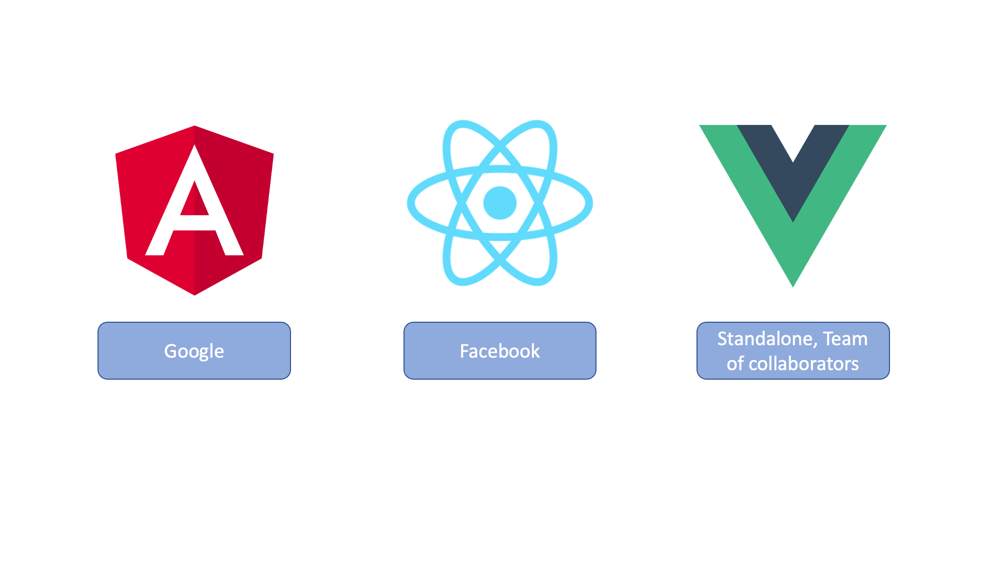

+++

### Web Technologies

#### Framework comparison

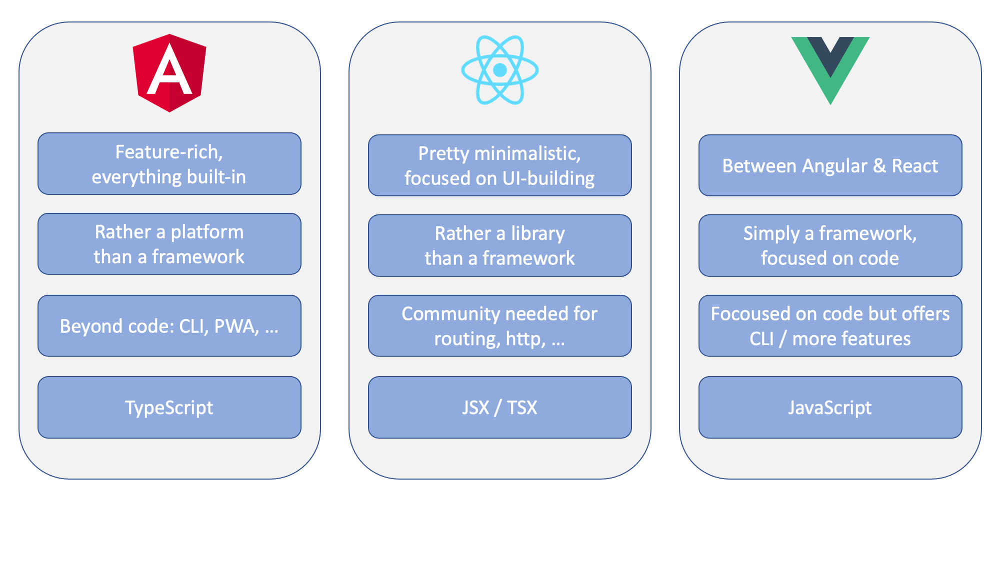

+++

### Web Technologies

#### Framework comparison

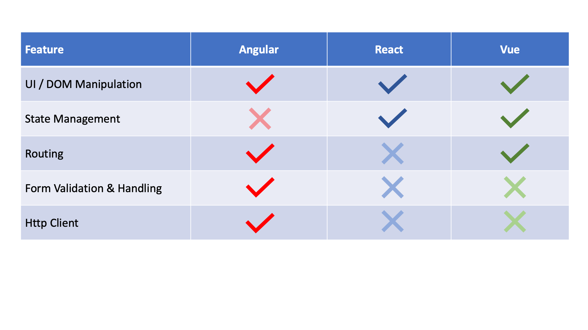

---

### Web Technologies

#### JavaScript

@snap[north-east]

@snapend

- Programming Language of the web & more!

  - Web Applications
  - Cross-Platform applications (Mobile & Desktop)
  - Server-Side applications (Node.js)

- Leverages web sites to be interactive
- Leverages user experience
- Makes web apps feel like desktop apps

+++


+++

### Web Technologies

#### JavaScript (ES5)

@snap[north-east]

@snapend

- Dynamic typings with 7 base types
- Functions as "First-Class-Objects" for functional programming
- Async Programming (Promises)
- Prototypic object orientation

+++

### Web Technologies

#### JavaScript (ES6 / ES2015)

@snap[north-east]

@snapend

- `let` & `const`
- default parameter values (`function myFunction(x, y = 10)`)
- classes
- modules
- arrow functions `() => {...}`
- spread operator `[...numbers]`
- ...

+++

### Web Technologies

#### JavaScript: Data Types and Values

@snap[north-east]

@snapend

- `number`
- `string`
- `boolean`
- `array`
- `object`

- `null`
- `undefined`

+++

### Web Technologies

#### JavaScript: Numbers

@snap[north-east]

@snapend

```javascript
34 === 34.0; // true
123e-5; // 0.00123
0xff; // 255

0.1 + 0.2; // 0.30000000000000004
(0.2 * 10 + 0.1 * 10) / 10; // 0.3

var number = 42;
number.toString(); // "42"
number.toString(2); // "101010"

42 * "party"; // NaN
```

+++

### Web Technologies

#### JavaScript: Strings

@snap[north-east]

@snapend

```javascript
"a string";
"another string";

"Hello" + " World"; // "Hello World"
"Hello ".concat("World"); // "Hello World"

"Hello World".substring(6); // "World"
"Hello World".substring(0, 5); // "Hello"
```

+++

### Web Technologies

#### JavaScript: Comparison [==/!=]

@snap[north-east]

@snapend

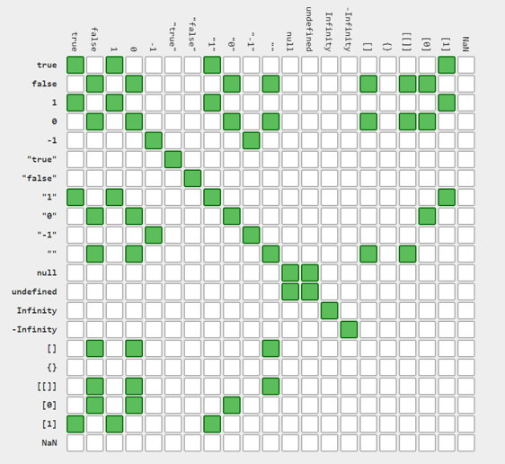

+++

### Web Technologies

#### JavaScript: Comparison [===/!==]

@snap[north-east]

@snapend

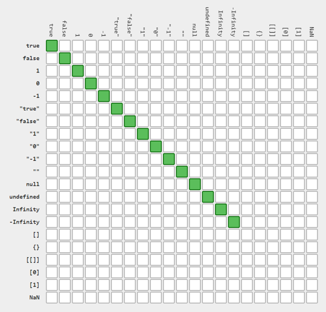

+++

### Web Technologies

#### JavaScript: Functions

@snap[north-east]

@snapend

```javascript
function multiply(x, y) {
  return x * y;
} // without ;

var add = function (x, y) {
  return x + y;
}; // with ;

add(1, 2, 3); // 3
add(); // NaN

function countArgs() {
  console.log(arguments.length);
}
countArgs(1, 2, 3, 4); // returns undefined, logs 4
```

+++

### Web Technologies

#### JavaScript & HTML

@snap[north-east]

@snapend

```html
<!DOCTYPE html>
<html>
  <body>
    <h1>A Web Page</h1>
    <p id="demo">A Paragraph</p>
    <button type="button" onclick="myFunction()">Try it</button>

    <script>
      function myFunction() {
        document.getElementById("demo").innerHTML = "Paragraph changed.";
      }
    </script>
  </body>
</html>
```

---

### Web Technologies

#### TypeScript

@snap[north-east]
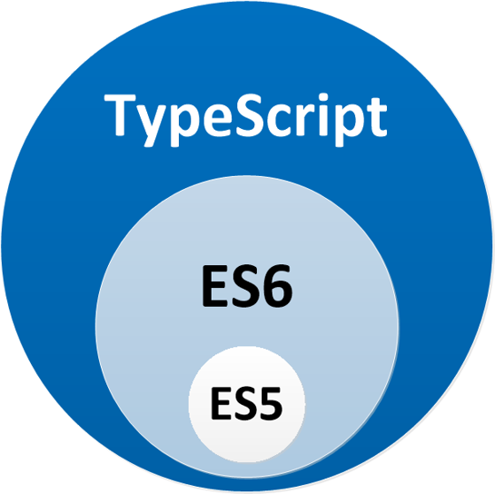
@snapend

- Developed & maintained by Microsoft
- TypeScript is a language for application-scale JavaScript development
- TypeScript is a typed superset of JavaScript
- Any browser. Any host. Any OS. Open Source.
  <br><br>
  > typescriptlang.org

+++

### Web Technologies

#### TypeScript: Design Goals

@snap[north-east]

@snapend

- Extend JavaScript for writing large apps (superset of JavaScript)
- Adds support for classes, interfaces & modules
- Development tooling support
- Transpiles to JavaScript

+++

### Web Technologies

#### TypeScript: Tooling Support

@snap[north-east]

@snapend

- Static type checking
- Strong type inference
- Symbol-based navigation
- Statement completion / intellisense
- Code refactoring
- SourceMaps

+++

### Web Technologies

#### TypeScript: Types

@snap[north-east]

@snapend

- All types are subtypes of a single top type called the `any` type
- Primitive Types
  - `number`
  - `bool`
  - `string`
  - `null`
  - `undefined`
- Object Types
  - Class, module, interface and literal types
  - Typed arrays: `var reports: Employee[] = []`

+++

### Web Technologies

#### TypeScript: Literal Types

@snap[north-east]

@snapend

```typescript
type CardinalDirection = "North" | "East" | "South" | "West";

function move(distance: number, direction: CardinalDirection) {
  // ...
}

move(1, "North"); // Okay
move(1, "Nurth"); // Error!
```

+++

### Web Technologies

#### TypeScript: Arrow Function Expressions

@snap[north-east]

@snapend

- New feature in ECMAScript 6
- Compact form of function expressions that omit the `function` keyword
- Similar to lamda expressions in C#

```typescript
hello = function () {
  return "Hello World!";
};
```

```typescript
hello = () => "Hello World!";
```

```typescript
hello = (val) => "Hello " + val;
```

+++

### Web Technologies

#### TypeScript: Classes

@snap[north-east]

@snapend

- Support for ECMAScript 6 alike classes
- Methods are translated into JavaScript prototype chain
- `public` and `private` member accessability
- Parameter property declarations via constructor
- Supports single-parent inheritance
- Derived classes make use of `super` calls to parent

+++

### Web Technologies

#### TypeScript: Classes

@snap[north-east]

@snapend

```typescript
class Animal {
  constructor(private name) {}
  move(meters) {
    alert(`${this.name} moved ${meters}m.`);
  }
}

class Snake extends Animal {
  move() {
    alert("Slithering…");
    super.move(5);
  }
}

class Horse extends Animal {
  move() {
    alert("Galloping…");
    super.move(45);
  }
}
```

+++

### Web Technologies

#### TypeScript: Interfaces

@snap[north-east]

@snapend

- Designed for development tooling support only
- No output when compiled to JavaScript
- Supports overload by parameter signature
- Supports implementing multiple interfaces

+++

### Web Technologies

#### TypeScript: Interfaces

@snap[north-east]

@snapend

```typescript
interface Drivable {
  start(): void;
  drive(distance: number) void;
  getPosition(): number;
}

class Car implements Drivable {
  private isRunning: bool = false;
  private distanceFromStart: number;

  public start(): void {
    this.isRunning = true;
  }

  public drive(distance: number): void {
    if (this.isRunning) {
      this.distanceFromStart += distance;
    }
  }

  public getPosition(): number {
    return this.distanceFromStart;
  }
}
```

+++

### Web Technologies

#### TypeScript: Structural Types

@snap[north-east]

@snapend

```typescript
interface Person {
  firstName: string;
  lastName: string;
}

function greeter(person: Person) {
  return "Hello, " + person.firstName + " " + person.lastName;
}

const user = { firstName: "John", lastName: "Doe" };

greeter(user);
```

+++

### Web Technologies

#### TypeScript: SourceMap Support

@snap[north-east]

@snapend

- Alleviates the debugging issues that are raised by `tsc` and JavaScript minifiers
- You aren't debugging the code that you wrote
- SourceMaps fixes this; it works like magic!
- A way to map transpiled / minified files back to their unbuilt state
- Allows debugging and having breakpoints from `.ts` files

---

### Web Technologies

#### Node.Js

@snap[north-east]

@snapend

- Runtime for server side JavaScript
- Node Package Manager (npm)
- Dependency Management
- Huge Ecosystem

+++

### Web Technologies

#### npm - package.json

@snap[north-east]

@snapend

```json
{
  "name": "@froko/ng-essentials",
  "version": "6.0.0",
  "description": "An essentials schematics for new Angular applications",
  "keywords": ["schematics"],
  "author": "Patrick Ineichen <github@frokonet.ch>",
  "repository": "git@github.com:froko/ng-essentials.git",
  "license": "MIT",
  "scripts": {
    "prebuild": "npm run schema2ts && npm run verify",
    "build": "tsc -p tsconfig.json",
    "test": "jest --watch",
    "preversion": "npm run build",
    "postversion": "git push && git push --tags"
  },
  "dependencies": {
    "@schematics/angular": "11.0.2",
    "decomment": "0.9.3"
  },
  "devDependencies": {
    "@angular-devkit/core": "11.0.2",
    "@angular-devkit/schematics": "11.0.2",
    "@types/decomment": "0.9.0",
    "@types/jest": "26.0.15",
    "@types/node": "14.14.10",
    "jest": "26.6.3",
    "typescript": "4.0.3"
  }
}
```

+++

### Web Technologies

#### npm - Command line tool

@snap[north-east]

@snapend

- Init (`npm init`)
- Global (`npm install -g <package-name>`)
- Local (`npm install (-D) <package-name>`)
- Install dependencies (`npm install`)
- Run scripts (`npm run <script-name>`)

---

### Workstation Setup

#### Software

- Install Git (https://git-scm.com/downloads)
- Install Node.js LTS Version (https://nodejs.org/en/download/)
- Install Visual Studio Code (https://code.visualstudio.com/Download)

+++

### Workstation Setup

#### Global npm Pakages

- `npm install -g @angular/cli` (mandatory)
- `npm install -g npm-check`
- `npm install -g rimraf`

---

## Exercise: sbb-app


---

### Angular

#### Basics

@snap[north-east]
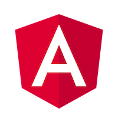
@snapend

- Evolution of AngularJs
- Framework by definition
- Built and maintained by Google
- OpenSource, huge community
- Release Schedule: 1 major version per 6 months

+++

### Angular

#### Basics

@snap[north-east]

@snapend

- Multi-Platform
  - Web (IE, Chrome, Firefox, …)
  - Mobile (Ionic, NativeScript)
  - Desktop (Electron)
- Speed & Performance
  - Lazy Loading
  - Tree Shaking
- Productivity (Angular-CLI, Schematics)
- Testability
- Internationalization (i18n)

+++

### Angular

#### Ecosystem (Default)

@snap[north-east]

@snapend

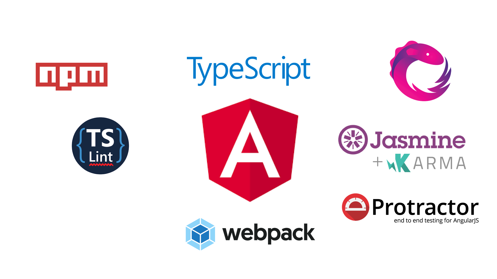

+++

### Angular

#### Ecosystem (ng-essentials)

@snap[north-east]

@snapend

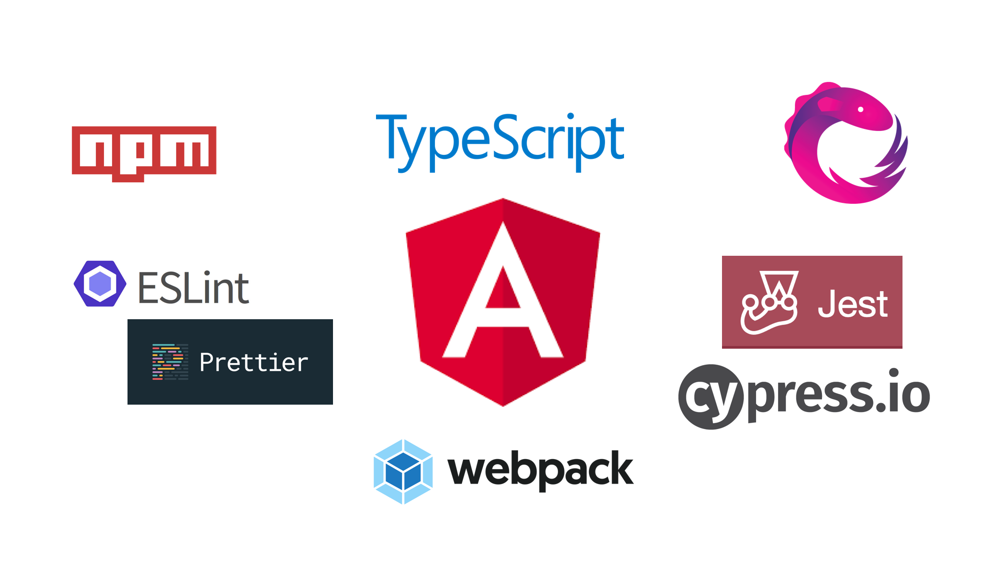

+++

### Angular

#### Ecosystem (extended)

@snap[north-east]

@snapend

- **i18n** (`@ngneat/transloco`)
- **Testing** (`@ngneat/spectator`, `ng-mocks`)
- **State-Management** (`ngrx` or `@ngxs/store`)
- **Component Explorer** (`storybook`)
- **UI Library** (`Bootstrap`, `AngularMaterial`, `PrimeNg`)

+++

### Angular

#### Architecture

@snap[north-east]

@snapend

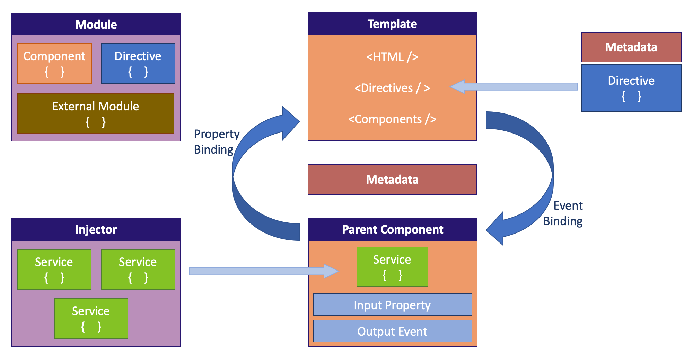

+++

### Angular

#### Component Tree

@snap[north-east]

@snapend

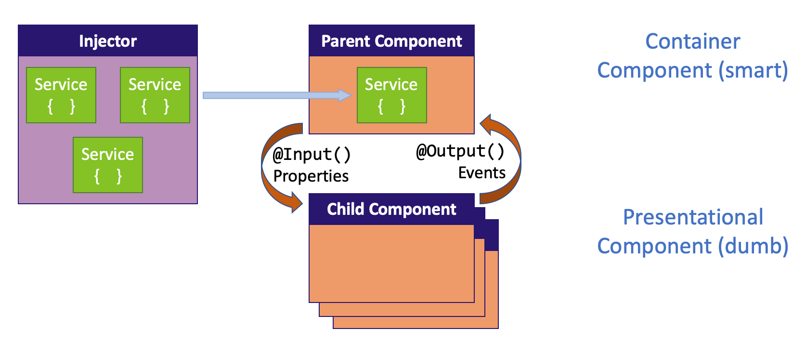

+++

### Angular

#### Building Blocks (core)

@snap[north-east]

@snapend

- **Modules** (Organize your application)
- **Components** (Create your own HTML elements)
- **Lifecycle Hooks** (Control the lifetime of your components)
- **Attribute Directives** (Change appearance or behavior of an element)
- **Structural Directives** (NgIf, NgSwitch, NgFor)
- **Pipes** (Format your data)
- **Services** (Separate your business logic out of your components)
- **Dependency Injection**

+++

### Angular

#### Building Blocks (Libraries)

@snap[north-east]

@snapend

- HTTP Client
- Routing & Navigation
- Forms
- Animations

+++

### Angular

#### Building Blocks (Modules)

@snap[north-east]

@snapend

<!-- prettier-ignore -->
```typescript
import { CommonModule } from '@angular/common';
import { HttpClientModule } from '@angular/common/http';
import { NgModule } from '@angular/core';
import { MatCardModule } from '@angular/material/card';

import { ConnectionComponent } from './connection/connection.component';
import { TimetableComponent } from './timetable/timetable.component';

@NgModule({
  declarations: [TimetableComponent, ConnectionComponent],
  imports: [CommonModule, HttpClientModule, MatCardModule],
  exports: [TimetableComponent],
})
export class SbbModule {}
```

<!-- prettier-ignore-end -->

+++

### Angular

#### Building Blocks (Components)

@snap[north-east]

@snapend

<!-- prettier-ignore -->
```typescript
@Component({
  selector: 'sbb-timetable',
  templateUrl: './timetable.component.html',
  styleUrls: ['./timetable.component.css'],
})
export class TimetableComponent implements OnInit {
  connections$: Observable<FlatConnection[]>;

  constructor(private service: SbbService) {}

  ngOnInit() {
    this.connections$ = this.service.getConnections('luzern', 'zürich');
  }

  onSelect(connection: FlatConnection) {
    console.log(connection);
  }
}
```

<!-- prettier-ignore-end -->

+++

### Angular

#### Building Blocks (Components)

@snap[north-east]

@snapend

```html
<div class="container">
  <div *ngFor="let connection of connections$ | async">
    <sbb-connection
      [connection]="connection"
      (select)="onSelect($event)"
    ></sbb-connection>
  </div>
</div>
```

+++

### Angular

#### Building Blocks (Components)

@snap[north-east]

@snapend

<!-- prettier-ignore -->
```typescript
@Component({
  selector: 'sbb-connection',
  templateUrl: './connection.component.html',
  styleUrls: ['./connection.component.css'],
})
export class ConnectionComponent {
  @Input() connection: FlatConnection;
  @Output() select = new EventEmitter<FlatConnection>();

  onClick() {
    this.select.emit(this.connection);
  }
}
```

<!-- prettier-ignore-end -->

+++

### Angular

#### Building Blocks (Components)

@snap[north-east]

@snapend

<!-- prettier-ignore -->
```html
<mat-card (click)="onClick()">
  <mat-card-header>
    <h3>{{ connection.from }} - {{ connection.to }}</h3>
  </mat-card-header>
  <mat-card-content>
    <p>
      {{ connection.from }} ab {{ connection.departure | date: 'HH:mm' }},
      Gleis {{ connection.fromPlatform }}
    </p>
    <p>
      {{ connection.to }} an {{ connection.arrival | date: 'HH:mm' }},
      Gleis {{ connection.toPlatform }}
    </p>
  </mat-card-content>
</mat-card>
```

<!-- prettier-ignore-end -->

+++

### Angular

#### Building Blocks (Lifecycle Hooks)

@snap[north-east]

@snapend

- `ngOnChanges()`
- **`ngOnInit()`**
- `ngDoCheck()`
- `ngAfterContentInit()`
- `ngAfterContentChecked()`
- **`ngAfterViewInit()`**
- `ngAfterViewChecked()`
- **`ngOnDestroy()`**

+++

### Angular

#### Building Blocks (Services)

@snap[north-east]

@snapend

<!-- prettier-ignore -->
```typescript
@Injectable({
  providedIn: 'root',
})
export class SbbService {
  constructor(
    @Inject('baseUrl') private baseUrl: string,
    private http: HttpClient
  ) {}

  getConnections(from: string, to: string): Observable<FlatConnection[]> {
    const url = `${this.baseUrl}/v1/connections?from=${from}&to=${to}&limit=12`;

    return this.http.get<any>(url).pipe(
      map((result) => result.connections as Connection[]),
      map((connections) =>
        connections.map((connection) => FlatConnection.from(connection))
      )
    );
  }
}
```

<!-- prettier-ignore-end -->

---

## Solution Walkthrough: ng-pm

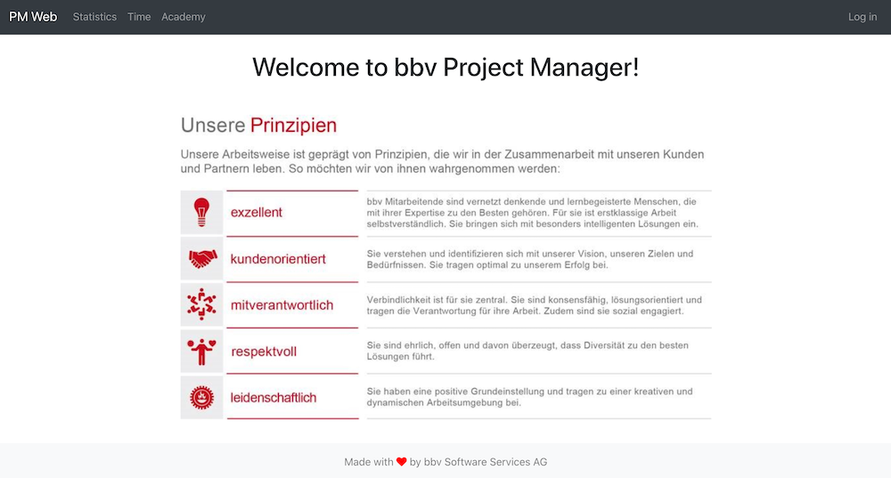

+++

## Solution Walkthrough: ng-pm (Architecture)

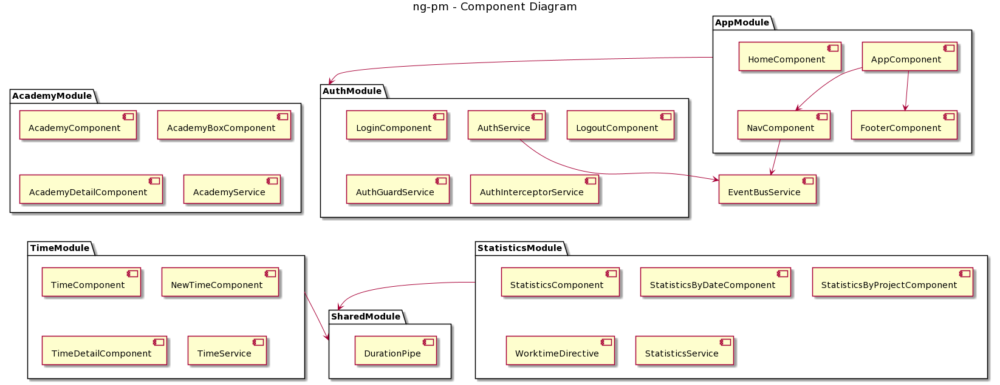

+++

## Hands-on Lab: ng-pm


---

### Angular

#### Best Practices

@snap[north-east]

@snapend

- Include as much as possible in a feature module
- Try to make feature modules as self-contained as possible
- Keep folder structure and modules in sync
  <br><br>
- Special module: `SharedModule` (`shared.module.ts`)

  Include components, pipes, directives and other modules that are shared across the application (typically imported by feature modules)

+++

### Angular

#### Best Practices

@snap[north-east]

@snapend

- Fix linting warnings as soon as possible
- Do code reviews
- Run tests / make them pass before checking in
- Establish continuous integration / continous delivery

+++

### Angular

#### Best Practices

@snap[north-east]

@snapend

- Component placement
  - next to the consuming component
  - into shared module
  - into library

+++

### Angular

#### Best Practices

@snap[north-east]

@snapend

- Follow the coding guidelines (https://angular.io/guide/styleguide)
- Look for a basic Mockup/Layout of your application. This helps identify modules and the component tree.
- Use code generation strategies (Angular CLI, Schematics)

---

### Angular

#### Quality

@snap[north-east]

@snapend

- **Code Style Quality** (EsLint, Prettier)
- **Code Consistency** (Naming, Blocks, ...)
- **Runtime Quality** (Bundle Sizes, Lazy Loading, Angular Universal, PWA, ...)
- **Design Quality** (Styling)
- **Functional Quality** (Jasmine, Jest, Cypress)

---

### Angular

#### Testing

@snap[north-east]

@snapend

- Angular's DI helps with testing in isolation
- Mocking

  - `jasmine.createSpyOby(...)`
  - `jest.fn()`
  - ng-mocks

- Snapshot Testing (only jest)
- Scoping (nested `describe` blocks)
- Code Coverage

---?image=assets/q-and-a.jpg&size=auto 80%
